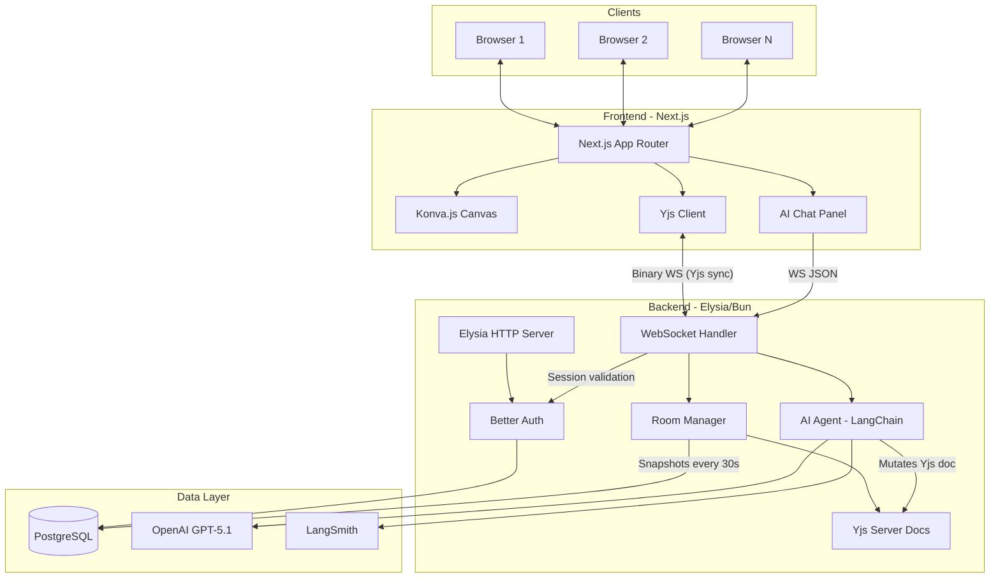

# CollabBoard

A real-time collaborative infinite whiteboard with an AI agent that manipulates the board through natural language. Built entirely with AI-first development methodology using Cursor.

**Live App:** [https://gsgarces.dev](https://gsgarces.dev)

---

## Submission Deliverables

| Deliverable | Location |
|---|---|
| Deployed Application | [gsgarces.dev](https://gsgarces.dev) (backend: [api.gsgarces.dev](https://api.gsgarces.dev)) |
| Pre-Search Document | [docs/pre-search.md](docs/pre-search.md) |
| AI Development Log | [docs/ai-development-log.md](docs/ai-development-log.md) |
| AI Cost Analysis | [docs/ai-cost-analysis.md](docs/ai-cost-analysis.md) |
| Demo Video | _TBD_ |
| Build Checklist | [docs/build-checklist.md](docs/build-checklist.md) |

---

## Table of Contents

- [CollabBoard](#collabboard)
  - [Submission Deliverables](#submission-deliverables)
  - [Table of Contents](#table-of-contents)
  - [Project Overview](#project-overview)
    - [Key Features](#key-features)
  - [Architecture](#architecture)
  - [Tech Stack](#tech-stack)
  - [AI Agent](#ai-agent)
  - [Getting Started](#getting-started)
    - [Prerequisites](#prerequisites)
    - [Setup](#setup)
  - [Environment Variables](#environment-variables)
    - [Backend (`apps/backend`)](#backend-appsbackend)
    - [Frontend (`apps/frontend`)](#frontend-appsfrontend)
  - [Scripts](#scripts)
    - [Development](#development)
    - [Database](#database)
    - [Performance](#performance)
    - [AI Analysis](#ai-analysis)
  - [Authentication](#authentication)
  - [Collaboration and CRDT](#collaboration-and-crdt)
  - [Smoke Test](#smoke-test)

---

## Project Overview

CollabBoard is a production-scale collaborative whiteboard where multiple users can simultaneously create and manipulate sticky notes, shapes, connectors, frames, and text on an infinite canvas. All changes sync in real-time via Yjs CRDT over WebSocket. An AI agent accepts natural language commands to create, modify, and layout board elements -- from simple "add a sticky note" to complex "build a SWOT analysis template."

### Key Features

- **Infinite canvas** with smooth pan/zoom (Konva.js)
- **7 element types**: sticky notes, rectangles, circles, lines, text, frames, connectors
- **Real-time collaboration**: multiplayer cursors, instant sync, presence awareness
- **Transforms**: move, resize, rotate with multi-select and group operations
- **Operations**: delete, duplicate, copy/paste with frame relationship preservation
- **AI agent**: 11 tools for creation, manipulation, layout, and complex templates
- **Auth**: email/password via Better Auth with session-protected routes and WebSocket

---

## Architecture



**Key architectural decisions:**

- **Yjs is the single source of truth** for board content. PostgreSQL stores metadata and periodic snapshots only.
- **AI mutations flow through the server.** AI commands arrive via WebSocket, execute server-side against the Yjs doc, and sync to all clients. The client never applies AI mutations directly.
- **Conflict resolution via CRDT.** Yjs handles concurrent edits automatically -- no custom merge logic needed.

---

## Tech Stack

| Layer | Technology |
|---|---|
| **Frontend** | Next.js 16, React 19, Konva.js (react-konva), Tailwind CSS, shadcn/ui |
| **Backend** | Elysia.js on Bun runtime |
| **Real-time Sync** | Yjs CRDT over binary WebSocket |
| **Authentication** | Better Auth (email/password, cookie sessions) |
| **Database** | PostgreSQL 16, Drizzle ORM |
| **AI Agent** | LangChain.js + OpenAI GPT-5.1 with function calling |
| **AI Observability** | LangSmith (tracing, cost tracking, latency analysis) |
| **State Management** | Zustand (canvas interaction state) |
| **Deployment** | Railway (Docker containers), custom domain via gsgarces.dev |
| **Monorepo** | Bun workspaces (`apps/backend`, `apps/frontend`, `packages/shared`) |

---

## AI Agent

The AI agent accepts natural language commands via a chat panel and manipulates the board through 11 tools:

| Category | Tools |
|---|---|
| **Creation** | `batchCreateElements` (sticky notes, shapes, text, frames), `bulkCreateElements` (grid of same-type elements) |
| **Modification** | `batchModifyElements` (move, resize, recolor, update text), `deleteObject` |
| **Connectors** | `createConnector` (arrows/lines between elements) |
| **Layout** | `layoutElements` (grid, row, column, wrap arrangements), `resizeFrameToFitContent` |
| **Templates** | `createQuadrant` (SWOT, Eisenhower), `createColumnLayout` (retro, kanban), `createDiagram` (flowchart, org chart, mind map) |
| **Query** | `getBoardState` (read current board for context) |

Commands range from simple ("add a yellow sticky note") to complex ("create a SWOT analysis for our product launch"). Multi-step commands execute atomically via Yjs transactions so all users see the result at once.

---

## Getting Started

### Prerequisites

- [Bun](https://bun.sh) installed
- Docker + Docker Compose installed

### Setup

1. Copy env file:

```bash
cp .env.example .env
```

2. Install workspace dependencies:

```bash
bun install
```

3. Start Postgres:

```bash
bun run db:up
```

4. Run database migrations:

```bash
bun run migrate
```

5. Start backend + frontend:

```bash
bun run dev
```

**Local URLs:**

- Frontend: `http://localhost:5173`
- Backend: `http://localhost:3000`
- Health check: `http://localhost:3000/api/health`

---

## Environment Variables

### Backend (`apps/backend`)

| Variable | Required | Default | Description |
|---|---|---|---|
| `DATABASE_URL` | Yes | -- | PostgreSQL connection string |
| `BETTER_AUTH_SECRET` | Yes | -- | Auth encryption secret (min 32 chars) |
| `BETTER_AUTH_URL` | No | `http://localhost:3000` | Backend base URL |
| `CORS_ORIGIN` | No | `http://localhost:5173` | Allowed origins (comma-separated) |
| `OPENAI_API_KEY` | Yes | -- | OpenAI API key for AI agent |
| `PORT` | No | `3000` | Server port |
| `LANGCHAIN_API_KEY` | No | -- | LangSmith API key (for AI tracing) |
| `LANGCHAIN_TRACING_V2` | No | -- | Set to `true` to enable tracing |
| `LANGCHAIN_PROJECT` | No | `default` | LangSmith project name |

### Frontend (`apps/frontend`)

| Variable | Required | Default | Description |
|---|---|---|---|
| `NEXT_PUBLIC_API_URL` | No | `http://localhost:3000` | Backend API URL |

---

## Scripts

### Development

```bash
bun run dev              # backend + frontend
bun run dev:backend      # backend only
bun run dev:frontend     # frontend only
bun run typecheck        # all workspaces
```

### Database

```bash
bun run db:up            # start Postgres container
bun run db:down          # stop Postgres container
bun run db:logs          # tail Postgres logs
bun run db:recreate      # destroy and recreate Postgres
bun run migrate          # run Drizzle migrations
```

### Performance

```bash
bun run perf:ws:ci       # WebSocket sync benchmarks
bun run perf:frontend:ci # Playwright frontend perf tests
bun run perf:check       # validate budgets from artifacts
bun run perf:ci          # all perf checks (CI pipeline)
```

### AI Analysis

```bash
bun run ai:cost-analysis      # cost breakdown + projections from LangSmith
bun run ai:perf-check         # AI response latency vs budgets
bun run ai:reliability-check  # AI command success rate
bun run ai:trace-review       # detailed trace analysis
```

---

## Authentication

Better Auth is mounted on the backend via `auth.handler`, exposing `/api/auth/*`.

- Email/password sign up and sign in
- Cookie-based sessions (secure + sameSite in production)
- Frontend uses Better Auth React client
- WebSocket connections validate session on upgrade
- Session endpoint: `GET /api/me`

---

## Collaboration and CRDT

Real-time sync uses Yjs CRDT over a custom Elysia WebSocket endpoint.

- **Endpoint:** `/ws/collab/:roomId`
- **Protocol:** Yjs binary sync over WebSocket frames
- **Room manager:** In-memory Yjs docs per room, persisted to PostgreSQL every 30 seconds
- **Presence:** Multiplayer cursors with name labels via lightweight WebSocket messages
- **Resilience:** Exponential backoff reconnect (1s-30s) with jitter, Y.Doc persists across reconnects

---

## Smoke Test

1. Open two browser windows
2. In both, create/sign in with separate users
3. Navigate both to `http://localhost:5173/canvas/main`
4. Move cursor in one window and confirm it appears in the other
5. Create a sticky note and verify it syncs to the other window
6. Verify auth guard by signing out and reopening `/canvas/main` (redirects to `/login`)
